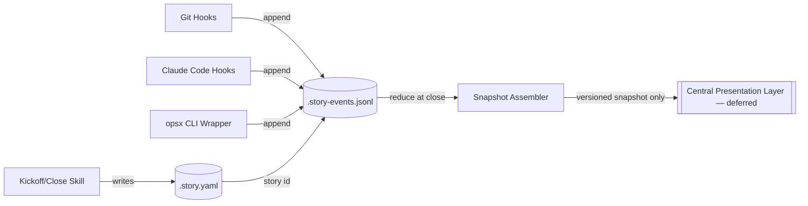

# Architecture Spine — AI Engineering Metrics Capture

## Design Paradigm

**Event-sourced pipes-and-filters.** Three independent sources (git hooks, Claude Code hooks, the openspec/speckit CLI wrapper) each *emit* events — none ever writes shared state directly. Events flow into one local append-only log per story (the pipe); a filter stage (the snapshot assembler, triggered at story close) reduces that log into one versioned snapshot (the sink), which is the only thing that ever leaves the developer's machine.



Layer → directory mapping:

- `capture/` — hook scripts and the CLI wrapper (producers; append-only, never read/mutate each other's state)
- `local-store/` — the per-story manifest, event log, and active-story pointer (all local, git-ignorable)
- `assembly/` — the snapshot assembler (the only reducer; the only writer of a snapshot)
- `adapters/` — one per source-of-truth backend (JIRA / Confluence / docs-only) and one per AI tool (AD-10; Claude Code today, Cursor/Copilot/Gemini deferred), each family behind its own single normalized interface

## Invariants & Rules

### AD-1 — Event-sourced convergence

- **Binds:** all capture-side producers (git hooks, Claude Code hooks, CLI wrapper)
- **Prevents:** three independent writers racing or corrupting one shared mutable file
- **Rule:** No producer writes to `.story.yaml` or any snapshot directly. Every producer only *appends* an event to the story's event log using a single atomic append syscall (open with `O_APPEND`, one `write()` per event, one event per line) — never read-modify-write the file, so concurrent appends from git hooks, Claude Code hooks, and the CLI wrapper cannot interleave or corrupt a line.

### AD-1a — Event type namespacing

- **Binds:** every event a producer appends
- **Prevents:** two producers legitimately emitting the same bare `type` (e.g. both a git hook and the opsx wrapper emitting `type: "commit"`) with different payload shapes, corrupting the assembler's reduction logic
- **Rule:** `type` is namespaced by source: `git.<event>` (e.g. `git.commit`, `git.checkout`, `git.merge`), `ai.<tool>.<event>` (e.g. `ai.claude-code.session_start`, `ai.cursor.tool_use`) — generalized from a Claude-only `claude.*` prefix so any AI-tool adapter (AD-10) can emit events without colliding — and `opsx.<event>` (e.g. `opsx.archive`). The assembler dispatches on the full namespaced string, never a bare suffix.

### AD-1b — Ordering: events may arrive before the manifest exists

- **Binds:** all producers, the snapshot assembler
- **Prevents:** one implementation buffering pre-manifest events while another silently drops them, producing inconsistent snapshots depending on timing
- **Rule:** A producer that fires before `.story.yaml` exists still appends its event to a pending/untagged local buffer (not discarded); the assembler backfills the story ID onto buffered events once the manifest is written, before reducing. No event is ever dropped for arriving early.

### AD-2 — Local-first intermediary

- **Binds:** the event log (`local-store/`)
- **Prevents:** capture depending on network availability or a running background service
- **Rule:** Events land in an append-only local file (`.story-events.jsonl`) in-repo. No daemon, no direct remote write, at capture time.

### AD-3 — Snapshot is the sole capture↔presentation contract

- **Binds:** the snapshot assembler and any future central presentation layer
- **Prevents:** the central store having to understand raw, source-specific event shapes (git-hook events vs. Claude Code hook events vs. wrapper events diverging silently)
- **Rule:** Only a versioned snapshot schema crosses the boundary to the central store. The raw event log never leaves the developer's machine and is not a contract either side may depend on.

### AD-3a — Snapshot internal shape and immutability

- **Binds:** the snapshot assembler, any consumer of a snapshot
- **Prevents:** one builder nesting Phase-1/Phase-2/variance fields under `story_point_cost` while another nests them under `pm_metrics.points` — and a re-close silently overwriting history that a downstream trend (AD-6, token-cost-per-point over time) depends on
- **Rule:** The snapshot envelope's top-level keys are exactly `{schema_version, story_id, revision, pm_metrics, engineering_metrics, story_point_cost, token_cost}`. `story_point_cost` is the only home for the Phase-1 estimate, Phase-2 actual, and their variance (`{phase1_points, phase2_points, variance}`) — no other family repeats these fields. Every `opsx archive` on the same story produces a **new immutable revision** (`revision` increments; nothing overwrites in place), so a re-close never destroys a prior snapshot a consumer already read.

### AD-4 — Source-of-truth adapter pattern

- **Binds:** `adapters/`, the kickoff skill
- **Prevents:** the kickoff flow hard-coding one PM tool (e.g. assuming JIRA) when a project has Confluence or no tool at all
- **Rule:** One normalized adapter interface returns `{points, goal, sprint, description}` regardless of backend. A project-level config (alongside `project-context.md`) declares `source_of_truth: jira | confluence | docs-only` **once**; the kickoff skill reads it and never re-asks per story. Adapter credentials (JIRA/Confluence API tokens) are read from environment variables or the developer's existing tool credential store at call time — never written into `.story.yaml`, the event log, or any snapshot (all of which may be shared/committed).

### AD-5 — Story identity lives in the manifest

- **Binds:** all producers, the snapshot assembler
- **Prevents:** inferring story identity from branch-naming or PM-tool conventions that not every project has
- **Rule:** `.story.yaml` (written by the kickoff skill) is the sole source of the story ID. Producers read it from the manifest; they never parse it out of a branch name or ticket key.

### AD-6 — Story-point estimation is two-phase, rule-driven, never silently overwritten

- **Binds:** the kickoff skill (Phase 1), the snapshot assembler (Phase 2)
- **Prevents:** manual point entry (meaningless once code is LLM-generated) and silent re-estimation that hides how far off the original guess was
- **Rule:**
  - **Phase 1 (at kickoff, from openspec state alone):** base points from task count in `tasks.md` (1–5→1-2, 6–15→3-5, 16–30→8-13, 30+→20+ and **must-split**); plus a volatility bonus from openspec stage maturity (`/opsx:explore`-only = +5 down to proposal+specs+design = 0); times a novelty modifier from pattern-matching prior `.story.yaml` records (first-time ×1.5 / standard ×1.0 / existing-pattern-reuse ×0.8).
  - **Phase 2 (at `opsx archive`, from the event log):** actual points from human review cycles (`UserPromptSubmit` follow-up count or PR review rounds), actual agent-narrated decision events, verification complexity (test files × weight: unit ×0.5 / integration ×1 / manual QA ×1.5 / perf ×2), and context management (files/components touched).
  - Phase 1 and Phase 2 figures are both recorded; the **variance** between them is logged, never collapsed into a single overwritten number.

### AD-7 — Time-on-task via an explicit active-story pointer

- **Binds:** `local-store/.active-story`, git `post-checkout` hook, Claude Code `SessionStart`/`PostToolUse`
- **Prevents:** silently inferring time-on-task from file edits alone (unreliable, mis-attributes time when a developer switches context)
- **Rule:** One local pointer file tracks the currently active story, updated automatically on `git checkout` and Claude Code `SessionStart` — never a manual command. Changing the pointer closes the outgoing story's time slice and opens a new one for the incoming story. An idle timeout (~15 min with no `PostToolUse`/prompt activity) auto-pauses the active slice. This relies on the confirmed team convention of **branch-per-story** (one branch = one story = one active context); there is currently no manual-override path for a developer working multiple stories on one branch. **Precedence when both triggers could fire** (a `git checkout` happens while a Claude Code session is already live): the live session's boundaries govern time-slice accounting — a mid-session checkout switches which story the *current* session's activity is attributed to, but does not itself close/reopen a session-level slice. A session-level slice only opens/closes on `SessionStart`/`SessionEnd`. This prevents double-counting or truncating time when both signals land close together.

### AD-8 — Hook installation is git-versioned, not per-machine

- **Binds:** `.git/hooks/`, `.claude/settings.json` hook entries
- **Prevents:** every developer's machine silently drifting to a different (or missing) set of hook scripts, since neither `.git/hooks/` nor a local `.claude/settings.json` is git-versioned by default
- **Rule:** Hook scripts live in a git-tracked directory (`tools/hooks/`) and a single committed setup script installs them into `.git/hooks/` and merges the required entries into `.claude/settings.json`. This setup script runs once per clone/checkout (a required onboarding step); no hook logic is hand-maintained per machine.

### AD-9 — Hook failures retry, then surface, never fail silently

- **Binds:** all capture-side producers (git hooks, Claude Code hooks, CLI wrapper)
- **Prevents:** a story's metrics coming out quietly incomplete because a hook errored once and nobody noticed (the "silent data loss" risk)
- **Rule:** A producer that fails to append an event retries up to 3 times; if it still fails, it surfaces a visible error to the developer rather than swallowing the failure. Silence is never an acceptable outcome for a failed capture.

### AD-10 — AI-tool capture adapter pattern

- **Binds:** `adapters/ai-tools/`, the kickoff manifest, AD-1a's namespacing, AD-6's Phase-2 reconciliation
- **Prevents:** hard-coding "everyone uses Claude Code" — and either breaking or silently under-reporting for a developer on Cursor, GitHub Copilot, Gemini, or another AI tool with different (or no) telemetry
- **Rule:** One normalized "AI activity" event shape (`session_start`, `session_end`, `activity_count`, `token_cost`) is emitted by a tool-specific adapter per AI tool, namespaced `ai.<tool>.*` (AD-1a). A field the tool genuinely cannot report (e.g. Copilot exposes no per-token cost) is emitted as **null with a reason**, never defaulted to zero — a null and a real zero must never be visually or computationally indistinguishable downstream. The kickoff manifest carries an `ai_tool` field, declared the same way as `source_of_truth` (AD-4): once per project by default, per-story only if a team genuinely mixes tools. When the active tool cannot supply the signals AD-6's Phase-2 formula depends on (decision-narration, token cost), that story's reconciliation is marked **reduced-confidence** and falls back to diff-size/commit-count proxies, rather than presenting a number with the same apparent confidence as a fully-instrumented Claude Code story.

## Consistency Conventions

| Concern | Convention |
| --- | --- |
| Naming (entities, files, interfaces, events) | Manifest: `.story.yaml`. Event log: `.story-events.jsonl`. Active pointer: `.active-story`. Snapshot: versioned, e.g. `snapshot.v1`. |
| Data & formats (ids, dates, error shapes, envelopes) | Event envelope: `{story_id, source, type, timestamp, payload}`. Snapshot envelope: `{schema_version, story_id, pm_metrics, engineering_metrics, story_point_cost, token_cost}`. Story ID always sourced from `.story.yaml`, never parsed from branch/ticket naming. |
| State & cross-cutting (mutation, errors, logging, config, auth) | Producers (AD-1) only append; only the snapshot assembler reduces/writes a snapshot. Only the snapshot (AD-3), never the raw event log, crosses the local↔central boundary. Source-of-truth is project-level config, read-only per story (AD-4). |

## Stack

| Name | Version |
| --- | --- |
| git hooks (`post-commit`, `post-checkout`, `post-merge`, `commit-msg`) | native git, no added dependency; verified stable, no staleness risk |
| Claude Code hooks — wired via `hooks` entries in `.claude/settings.json` (event → matcher → command), **not** auto-discovered by folder/filename | this spine uses six of the available events: `SessionStart`, `SessionEnd`, `PreToolUse`, `PostToolUse`, `Stop`, `UserPromptSubmit`; more events exist (e.g. `SubagentStop`, `PreCompact`, `Notification`) and are out of scope here |
| openspec ([Fission-AI/OpenSpec](https://github.com/Fission-AI/OpenSpec)) / speckit ([github/spec-kit](https://github.com/github/spec-kit)) CLI | existing project tooling, wrapped not modified; verified current and maintained |

## Structural Seed

```text
{repo-root}/
  .story.yaml              # kickoff manifest — story identity + PM metadata (AD-5)
  .story-events.jsonl       # append-only local event log, git-ignored (AD-2)
  .active-story             # current active-story pointer, git-ignored (AD-7)
  .claude/
    settings.json            # hook entries (event -> matcher -> command) point at tools/hooks/claude/* (AD-8)
    skills/
      story-kickoff/        # human bookend: points/goal/sprint confirmation
      story-close/          # human bookend: actual-vs-blockers note
  tools/
    hooks/
      git/                  # post-commit, post-checkout, post-merge, commit-msg scripts, installed by setup (AD-8)
      claude/                # scripts referenced by .claude/settings.json hook entries (AD-8)
    setup-hooks              # committed installer: wires tools/hooks/git/* into .git/hooks/, merges .claude/settings.json (AD-8)
    opsx-wrapper/            # intercepts openspec/speckit CLI invocations
    snapshot-assembler/      # reduces the event log into a versioned snapshot at close (AD-3, AD-3a)
    adapters/
      jira/
      confluence/
      docs-only/
```

### Deployment & Environments

- **Capture side runs entirely on the developer's machine** — no server, no network dependency (AD-2). The only environment concern is that `tools/setup-hooks` has run for that clone (AD-8).
- **Central presentation layer's deployment target, hosting, and provider are Deferred** — only its input contract (the versioned snapshot, AD-3/AD-3a) is fixed here.
- Local-only files (`.story-events.jsonl`, `.active-story`) are `.gitignore`d; `.story.yaml` and any produced snapshot files *are* intended to be committed/shared (they carry no credentials — see AD-4).

## Deferred

- **Central presentation layer** (new lightweight service + DB, or an existing BI tool) — technology, hosting, and environment topology not yet chosen; only its input contract (the versioned snapshot, AD-3) is fixed.
- **Snapshot schema's exact field-level shape and migration strategy** — start at `v1`, no migration tooling yet.
- **Manual-override path for the active-story pointer** if a developer ever works multiple stories on one branch — no escape hatch defined; branch-per-story is currently assumed to hold universally (AD-7).
- **Story-point weight tuning** — confirmed best-guess: the Phase-1/Phase-2 tables (AD-6) are seeded from an existing internal reference document that was never validated against real AI-driven delivery data. Expect retuning once usage data accumulates.
- **Variance feedback loop** — Phase-1 vs Phase-2 variance (AD-6) is captured and logged, but there is no defined process or threshold yet for *acting* on it (i.e. recalibrating the AD-6 weights). Deliberately left for a later pass.
- **Adapter credential provisioning mechanics** (how a developer's JIRA/Confluence token gets into their environment in the first place) — AD-4 fixes that credentials never enter shared files, but not the provisioning flow itself.
- **AI-tool adapters beyond Claude Code are not yet built** — AD-10 fixes the boundary (one normalized shape, `ai.<tool>.*` namespacing, an `ai_tool` manifest field, graceful degradation of AD-6 reconciliation), but only a Claude Code adapter exists today. Cursor, Copilot, Gemini, and others each need their own adapter implementation, deliberately pushed past the pilot (which stays Claude-Code-only per current Non-goals).
- **Rollout sequencing** — the plan is a small pilot group of developers first, using pilot data to tweak the AD-6 story-point formula before wider rollout. Multi-repo scaling and schema-versioning ownership are explicitly out of scope until the pilot proves out.
- **A fourth source-of-truth adapter (GitLab)** — AD-4 only designs JIRA, Confluence, and docs-only. GitLab (or any other PM tool) is held for later; add only if real demand emerges.
