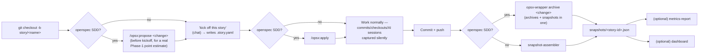

# Daily-Use Flow Diagrams

Mirrors `tools/build-release/INSTALL.md`'s "Daily use" step lists exactly. If those
steps change, update this file too.

## Docs-only flow (`source_of_truth: docs-only`, or absent)

## JIRA flow (`source_of_truth: jira`)

```mermaid
flowchart LR
    A["git checkout -b story/&lt;name&gt;"] --> B["'kick off this story &lt;ISSUE-KEY&gt;'<br/>→ Atlassian MCP fetches points/goal/sprint<br/>→ writes .story.yaml"]
    B --> C{"openspec SDD?"}
    C -- yes --> D["/opsx:propose &lt;change&gt;<br/>(AFTER kickoff — no JIRA-fetch<br/>capability of its own)"]
    C -- no --> E
    D --> E{"openspec SDD?"}
    E -- yes --> F["/opsx:apply"]
    E -- no --> G
    F --> G["Work normally —<br/>same silent capture"]
    G --> H["Commit + push"]
    H --> I{"openspec SDD?"}
    I -- yes --> J["opsx-wrapper archive &lt;change&gt;"]
    I -- no --> K["snapshot-assembler"]
    J --> L["snapshots/&lt;story-id&gt;.json"]
    K --> L
    L --> M["(optional) metrics-report"]
    L --> N["(optional) dashboard"]
```

**The one real structural difference:** JIRA's kickoff must run **before**
`/opsx:propose` (no JIRA-fetch capability of its own — it would otherwise fall
back to unauthenticated `WebFetch`, which can't reach an authenticated Atlassian
page). Docs-only runs `/opsx:propose` **before** kickoff instead, so the Phase-1
estimator has a real `tasks.md` to read.
