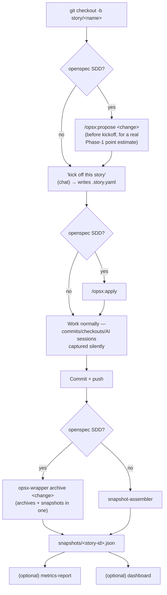
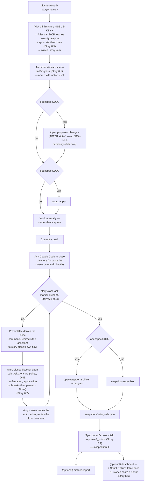

# Daily-Use Flow Diagrams

Mirrors `tools/build-release/INSTALL.md`'s "Daily use" step lists exactly. If those
steps change, update this file too.

## Docs-only flow (`source_of_truth: docs-only`, or absent)

## JIRA flow (`source_of_truth: jira`)

**The one real structural difference:** JIRA's kickoff must run **before**
`/opsx:propose` (no JIRA-fetch capability of its own — it would otherwise fall
back to unauthenticated `WebFetch`, which can't reach an authenticated Atlassian
page). Docs-only runs `/opsx:propose` **before** kickoff instead, so the Phase-1
estimator has a real `tasks.md` to read.

**The close-time detour (Epic 6) only exists for JIRA-backed stories.** Docs-only
and Confluence-backed stories skip straight from "Commit + push" to the close
command, exactly as the diagram above shows for docs-only. The `story-close-ack`
marker check (Story 6.8) is what makes the JIRA sync in step I4 actually reliable —
without it, a pasted close command could silently skip the whole detour (the bug
this mechanism fixes; see `INSTALL.md`'s Known Limitations for the full story).

## Release testing checklist (JIRA, fresh-install round)

This is the pilot-testing procedure used to verify a fresh release end-to-end
(re-installing from scratch, not the normal per-story flow a developer follows —
a real developer installs once and skips straight to "Daily use" above for every
subsequent story).

```mermaid
flowchart
    A["Uninstall (uninstall.ps1/.sh)"] --> B["Confirm .claude/settings.json<br/>and .story-config.yaml removed"]
    B --> C["Re-install fresh<br/>(install.ps1/.sh, latest release)"]
    C --> D["uv run tools/setup-hooks.py --repo-root ."]
    D --> E["Confirm hooks wired into<br/>.claude/settings.json"]
    E --> F["Confirm/set .story-config.yaml:<br/>source_of_truth: jira"]
    F --> G["Confirm .story.yaml absent<br/>(no story left open)"]
    G --> H["claude mcp add --transport http atlassian ..."]
    H --> I["git checkout -b story/&lt;name&gt;"]
    I --> J["Invoke story-kickoff,<br/>give it a JIRA issue key"]
    J --> K["Confirm points/goal/sprint"]
    K --> L["Confirm .story.yaml written<br/>(source_of_truth: jira + issue key)<br/>+ sprint dates, if the sprint<br/>has started (Story 6.5)"]
    L --> L2["Confirm the issue really<br/>transitioned to In Progress<br/>(Story 6.1)"]
    L2 --> M["Do real work —<br/>commits, normal coding session"]
    M --> N["(optional) trigger a real<br/>test/build failure"]
    N --> O["(optional) log-defect →<br/>real JIRA subtask"]
    O --> P["End session<br/>(/exit + Ctrl+D or close the<br/>whole window — NOT the panel<br/>'x' button, or token_cost stays null)"]
    P --> Q["Ask Claude Code to close<br/>the story"]
    Q --> Q2{"Pasted the raw close<br/>command directly?"}
    Q2 -- yes --> Q3["Confirm it gets denied +<br/>redirected (Story 6.8),<br/>then retries and succeeds"]
    Q2 -- no --> Q4["Confirm the ONE confirmation<br/>appears (sub-tasks + parent<br/>→ Done, points synced)"]
    Q3 --> R["Independently re-fetch the<br/>JIRA issue — confirm sub-tasks<br/>+ parent really are Done, and<br/>points really match phase2_points"]
    Q4 --> R
    R --> S["metrics-report"]
    S --> T["dashboard — confirm Sprint<br/>Rollups table appears once<br/>2+ stories share a sprint"]
    T --> U["Paste back snapshot/report/dashboard<br/>for verification"]
```

